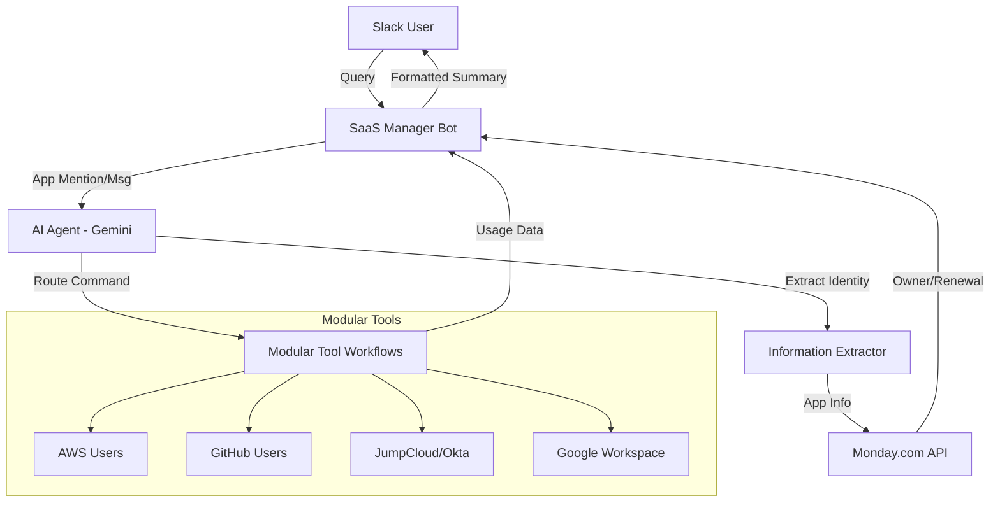

# SaaS Governance Suite

## Overview
A comprehensive system for real-time visibility and management of SaaS applications across the organization. This suite allows IT and Procurement teams to instantly query ownership, usage, and access details directly from Slack.

## Solutions Included

### 1. SaaS Manager Bot (AI Agent)
An advanced Slack assistant that uses natural language processing to fetch live data from over 15+ connected platforms.
- **Problem**: Decentralized access visibility leading to audit delays.
- **Solution**: Centralized AI routing to modular application tools.
- **Result**: Instant "Source of Truth" for application access in Slack.

### 2. Monday.com App Metadata Lookup
A specialized workflow that connects directly to the master SaaS Inventory on Monday.com.
- **Problem**: Manual search for app owners and renewal dates.
- **Solution**: Automated data processing of Monday.com boards.
- **Result**: Automated retrieval of manager emails and renewal milestones.

## Technical Components
### Primary Workflows
- **SaaS Management (Main)**: The orchestrator using LangChain and Gemini.
- **SaaS Manager (Lookup)**: The bridge for Monday.com structured data.

### Supported Integrations
- **IDP/Infrastructure**: AWS, JumpCloud, Okta.
- **Productivity**: GWorkspace, Slack, GitHub, Monday.com.
- **SaaS Specific**: Loom, Miro, Notion, MixMax, Unleash, Pendo.

---
*Powered by IT Automation*
