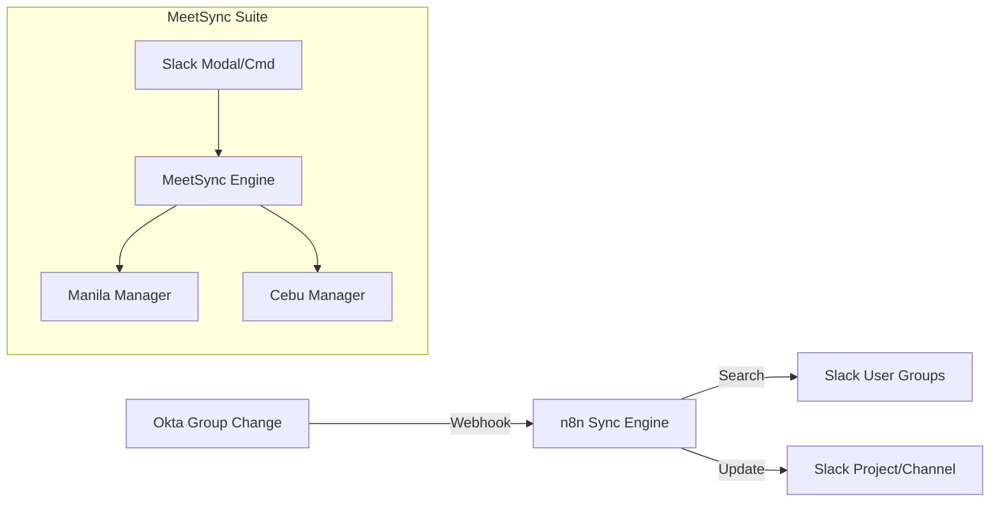

# Sync Utilities & Collaboration

## Overview
A collection of workflows designed to maintain consistency between identity providers (Okta) and collaboration platforms (Slack), as well as managing shared resources like meeting spaces.

## Solutions Included

### 1. Okta Group <> Slack Project Sync
Automates the assignment of employees to specialized Slack project groups based on their membership in Okta groups.
- **Problem**: Manual overhead of adding/removing members from project-specific Slack groups.
- **Solution**: Real-time sync between Okta and Slack.
- **Result**: Reduced administrative friction and "Day 1" access for project teams.

### 2. MeetSync (Resource Management)
Provides a Slack-based interface for managing meeting room requests and resource allocation across different offices.
- **Components**:
    - **Open Slack Modal**: The user interface for entry.
    - **Manila/Cebu Managers**: Location-specific processing logic.
- **Result**: Self-service resource management directly in the company's primary communication tool.

---
*Powered by IT Automation*
