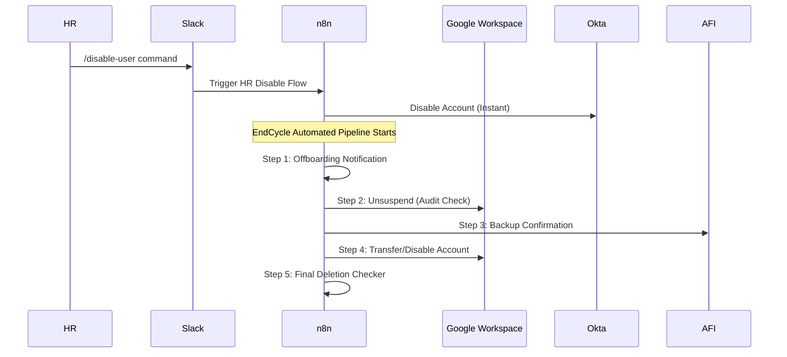

# User Lifecycle (Offboarding)

## Overview
A secure, automated pipeline for managing the employee exit process. This solution ensures that access to critical systems (Okta, Google Workspace, AFI) is revoked in a timely, audited, and coordinated manner.

## Components

### 1. Instant HR Disable Command
Allows HR to instantly disable a user's Okta account after their final talk, ensuring immediate access revocation.
- **Workflow**: `HR <> Okta Disable Command`
- **Key Nodes**: Slack Slash Command, Okta API.

### 2. EndCycle: 5-Step Offboarding Pipeline
A multi-stage scheduled process that handles the heavy lifting of data transfer and account cleanup.
- **Step 1**: Initial Notification and triggers.
- **Step 2**: Google Workspace unsuspension for audit/checker tasks.
- **Step 3**: AFI Command Backup verification.
- **Step 4**: Primary Google Account transfer and suspension logic.
- **Step 5**: Final verification and account deletion.

## Results
- **Security**: Zero-lag revocation of Okta access upon HR command.
- **Compliance**: Fully audited steps for data backup and transfer.
- **Efficiency**: Replaces hours of manual checklist work per offboarded employee.

---
*Powered by IT Automation*
